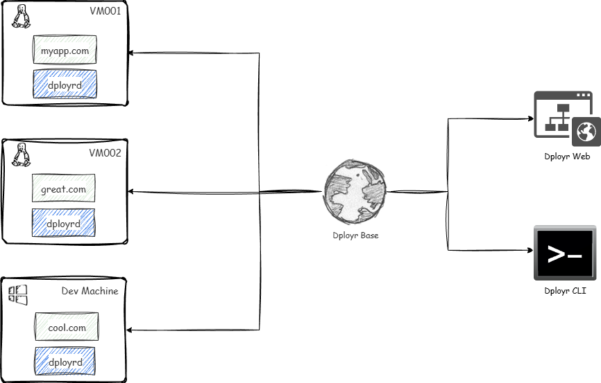

# Concepts

## Introduction

If you have a couple of VMs to look after (a cheap VPS, a home lab, a Raspberry Pi), you probably know the drill: remote copy files over, SSH in, restart a process, tail logs, then do it again on the next VM.

The other thing you usually want is predictability: the same deploy steps every time, with the same runtime version, without relying on “whatever happens to be installed” on a box.

Docker can solve some of that, but it can also be overkill for simple projects. Not every project needs a container - sometimes you just want to run a simple Node.js, PHP, Java, or Python app directly on the VM. For those cases, Dployr gives you a programmable deployment workflow (blueprints) for VMs. Docker amongst other runtimes e.g Node.js, PHP, Java, Python etc. is supported, but it is treated as one runtime option, not a requirement.

The model is:
- **Base** is the globally distributed control plane.
- Each **VM** runs [`dployrd`](https://github.com/dployr-io/dployr) (a lightweight daemon) that establishes an outbound connection to **Base**.
- [Web](https://app.dployr.io/) and the **CLI** talk to **Base**, which relays the requests to the appropriate **VM**.

When you make a deployment, open a console, stream logs, or perform any other action, the request goes to the **Base**, then down to the right VM through the same long-lived WebSocket connection.

## Architecture

*Dployr maintains a persistent mTLS WebSocket connection between the agent and the base.*

## Core components

### Base

**Base** is the globally distributed control plane. Web and the CLI talk to **Base**, and **Base** routes those requests to the right VM through `dployrd`.

- It exposes the [API](https://api-docs.dployr.io/) used by Web and the CLI.
- It handles authentication and authorization (RBAC) and records actions.
- It schedules work and keeps state for projects, VMs, deployments, and services.

You can use the hosted base (run by dployr), or self-host the base yourself using [dployr-base](https://github.com/dployr-io/dployr-base). Either way, each VM only needs an outbound connection to **Base**.

### Agent (`dployrd`)

[`dployrd`](https://github.com/dployr-io/dployr) is a lightweight daemon that runs on your VM.

- It maintains a long-lived, outbound WebSocket connection to **Base** (mTLS).
- It receives requests from **Base** (deploy, restart, run commands) and executes them locally.
- It streams logs and status back to **Base**.

### Web

The Web UI is available at [app.dployr.io](https://app.dployr.io/) (source: [dployr](https://github.com/dployr-io/dployr)). It talks to **Base**.

### CLI

The CLI follows the same pattern as Web - it talks to **Base**. 

## Synchronization (how base and VMs talk)

Dployr is designed so your VMs do not need to accept inbound traffic from the internet.

- Each `dployrd` agent generates a client certificate.
- The base uses that certificate to authenticate the agent (mTLS).
- The agent keeps a persistent connection and reconnects automatically.
- Work is pushed over that connection in real time.

That same connection is also what makes the “debug from one place” features possible:

- **Console**: interactive shell sessions are tunneled from Web to the VM through the base and `dployrd`.
- **Logs**: logs are streamed over WebSocket rather than scraped or polled.

## Authentication and tokens

### Bootstrap token

Used once when registering a new agent.

### Access token

Short-lived token used for API calls. The agent refreshes it automatically every 5 minutes.

## Logging

[`dployrd`](https://github.com/dployr-io/dployr) writes structured JSON logs to `/var/log/dployrd/app.log` for debugging.

## Deployments

Deployments describe what to run on a VM and how to run it.

You can create deployments in two ways:

- A guided form (good for getting started)
- A blueprint (good for repeatable, reviewable, version-controlled setups). See [Blueprints](/docs/blueprints).

## Services

Services are long-running processes managed by dployr.

- Restart on failure
- Environment variables
- Port management
- Log collection

## Proxy

Dployr uses [Caddy](https://caddyserver.com/) as a reverse proxy in front of services.

## Runtimes

Dployr manages language runtimes using [vfox](https://vfox.dev/), enabling consistent installation and switching across VMs. Supported runtimes include Node.js, Python, Go, PHP, Ruby, .NET, Java, Docker, and Static.

## Security model

### mTLS

All agent-to-base traffic is encrypted and mutually authenticated.

### RBAC

Permissions are scoped by role, and actions are recorded. This is what makes audit-friendly workflows possible in teams.

## Next Steps

- [Dployr Web](/docs/dployr-web)
- [Write a blueprint](/docs/blueprints)
- [Explore CLI commands](./cli)
- [View API reference](./api)
