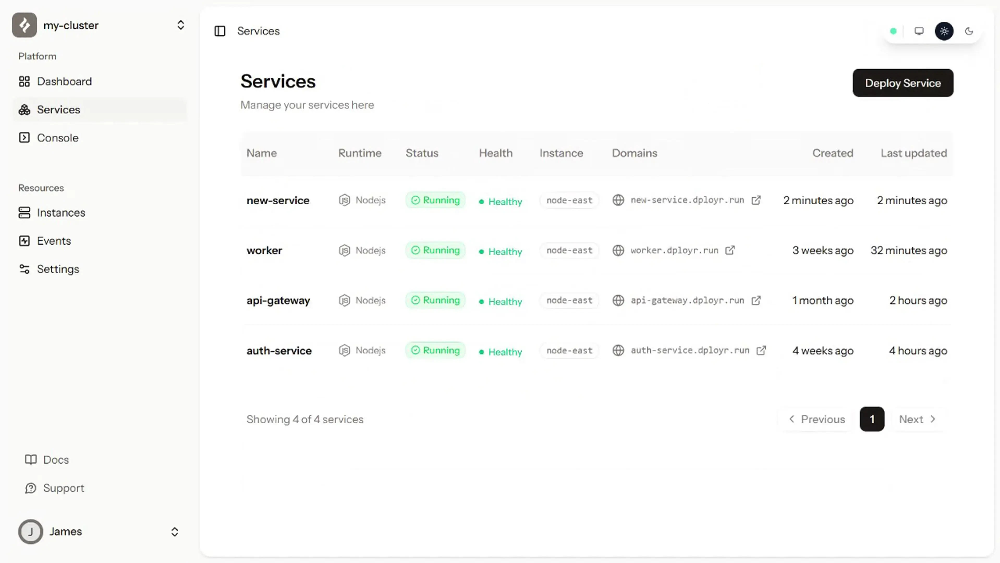
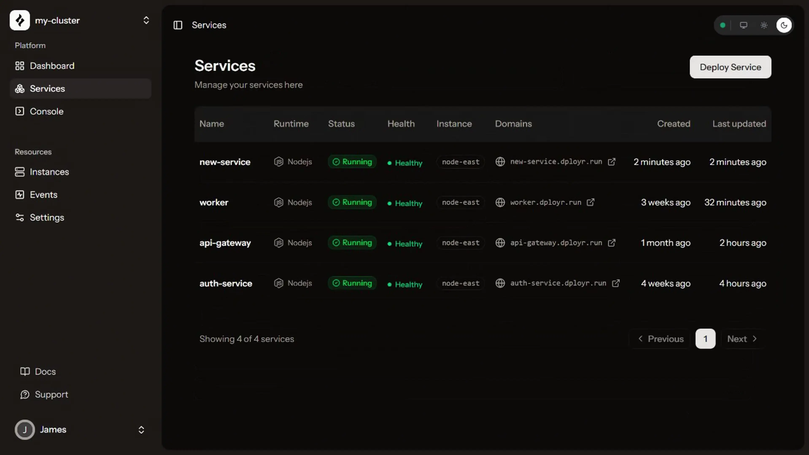

# The dployr dashboard

The dashboard is at [app.dployr.io](https://app.dployr.io). Everything you need to deploy, monitor, and manage your cluster lives here.

## Deploying a service

From the dashboard, click **Deploy Service** from the cluster overview or the services list. A panel opens with two ways to configure your deployment.

### Quick Deploy

A form that walks you through every option. Pick your source, runtime, build and run commands, port, and name. You can configure environment variables and secrets inline before submitting. Good for one-off deploys and getting started.

<video src="../public/quick-deploy.webm" autoplay loop muted playsinline class="light-only" style="width:100%;border-radius:8px"></video>
<video src="../public/quick-deploy-dark.webm" autoplay loop muted playsinline class="dark-only" style="width:100%;border-radius:8px"></video>

### Blueprint Editor

A code editor that lets you write your deployment config as YAML, JSON, or TOML. The editor stays in sync with the Quick Deploy form, so changes in one reflect in the other. If you paste or type a blueprint directly, the form updates automatically.

Blueprints are useful when you want to version your deployment config or reuse the same setup across multiple services. See [Blueprints](/docs/blueprints) for the full field reference.

<video src="../public/blueprint-editor.webm" autoplay loop muted playsinline class="light-only" style="width:100%;border-radius:8px"></video>
<video src="../public/blueprint-editor-dark.webm" autoplay loop muted playsinline class="dark-only" style="width:100%;border-radius:8px"></video>

## Services list

The services list shows every service in your cluster: name, runtime, status, health, the instance it's running on, and its domain. Click a service to open its detail view.

## Service detail

Each service has four tabs.

**Overview** shows traffic metrics, request counts, and service metadata.

**Logs** streams live output from your service over WebSocket. Logs appear as they happen. You can scroll back through history or let it run in real time. If your service crashed, the reason is here.

**Metrics** shows CPU and memory usage over time.

**Settings** lets you update the service config: port, build and run commands, description. Changes take effect on the next deploy.

<video src="../public/03.webm" autoplay loop muted playsinline class="light-only" style="width:100%;border-radius:8px"></video>
<video src="../public/03-dark.webm" autoplay loop muted playsinline class="dark-only" style="width:100%;border-radius:8px"></video>

## Live logs

Logs stream in real time from the **Logs** tab on any service. If your service crashed, the output is here. If the build failed, that's here too.

<video src="../public/logs.webm" autoplay loop muted playsinline class="light-only" style="width:100%;border-radius:8px"></video>
<video src="../public/logs-dark.webm" autoplay loop muted playsinline class="dark-only" style="width:100%;border-radius:8px"></video>

## Console Pro

A full terminal on your server, right in the browser. No SSH keys, no open ports, nothing to set up.

<video src="../public/console.webm" autoplay loop muted playsinline class="light-only" style="width:100%;border-radius:8px"></video>
<video src="../public/console-dark.webm" autoplay loop muted playsinline class="dark-only" style="width:100%;border-radius:8px"></video>

## File explorer Pro

Make a quick change on your server without SSH, a redeploy, or leaving the browser.

<video src="../public/file-explorer.webm" autoplay loop muted playsinline class="light-only" style="width:100%;border-radius:8px"></video>
<video src="../public/file-explorer-dark.webm" autoplay loop muted playsinline class="dark-only" style="width:100%;border-radius:8px"></video>

