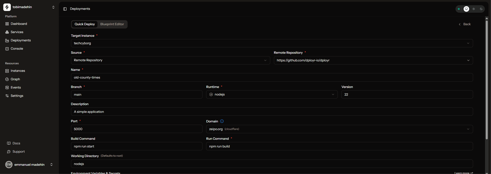
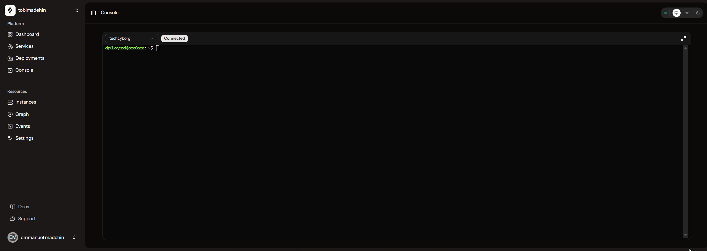
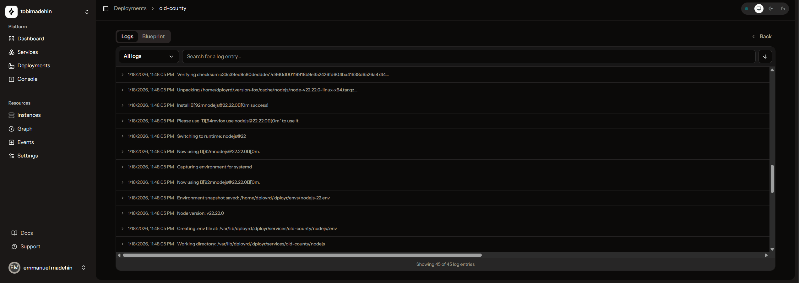
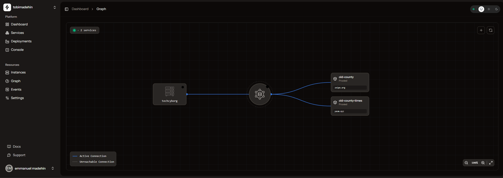
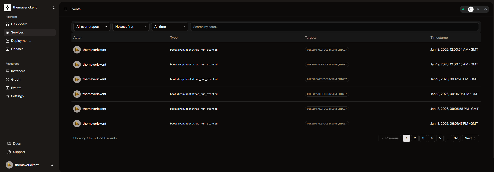
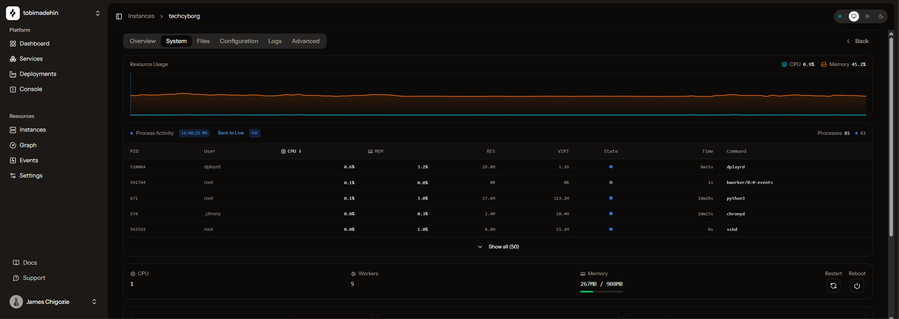
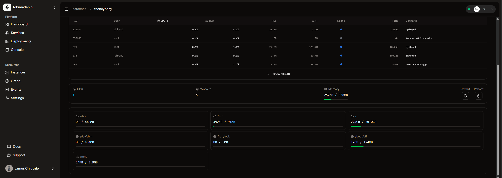

# Dployr Web

The Web UI is available at [app.dployr.io](https://app.dployr.io/) (source: [dployr](https://github.com/dployr-io/dployr)). It talks to **Base**, which routes actions to the right VM through `dployrd`.

## Deploy

Deployments can be configured with a form builder, or defined programmatically as blueprints.

If you want the blueprint format and examples, see [Blueprints](/docs/blueprints).

## Console

An interactive shell in the browser. It uses the VM’s `dployrd` connection, so you can open a session without initiating an SSH connection to the VM.

## Logs

Logs are streamed over WebSocket.

## Graph

A resource graph showing services, apps, and live connections.

## Events

Every important action is recorded as an event. In a team, this pairs with RBAC so you can answer “who did what, and when”.

## Process viewer

View running processes and system stats from your VM.

## File explorer

Browse files on your VM with an interactive file explorer.

## Next Steps

- [Learn about core concepts](./concepts)
- [Write a blueprint](./blueprints)
- [Use the CLI](./cli)
